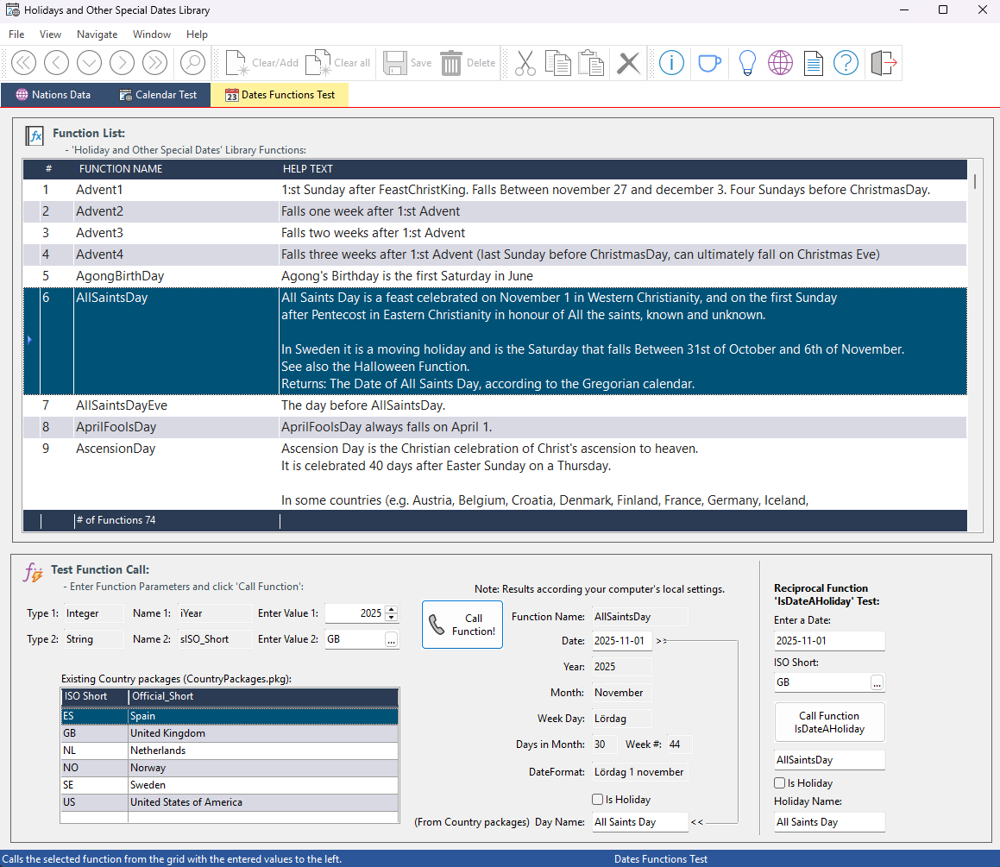

# Demo for 'Library-HolidaysFuncLib'

The `oCalendarHolidays.pkg` contains essential functions for managing holiday dates. For detailed information on how this function library operates, please refer to the documentation located at the top of `cCalendarHolidays.pkg`.

To see the 'Holiday Functions Library' in action, run the sample program `HolidaysFuncLibTest`. In the 'Dates Functions Test' tab, you will find a grid displaying built-in 'Holidays and Other Important Dates.' Enter a year in the lower section and click the 'Call Function' button to find out the date of a holiday or special day. You can also enter an ISO-2 character country code in the 'Enter Value 2:' field to view the name of the holiday or special day at the bottom of the screen. Please note that a limited number of 'National Holiday' packages are currently available, which are listed in the grid in the lower-left corner.

If your country is not included in the grid, creating a new one is quite simple! Just refer to the examples in `CountryPackages.pkg` for guidance on how to do this.

In the 'Calendar Test' tab, you can see an example of how to create your own calendar that includes the names of holidays and special days. Additionally, there is a sample of a generalized lookup list for holidays. Click the 'Test Holiday Lookup List' button to see how this feature can be used to retrieve any selection of holidays.

In addition to the `oCalendarHolidays` package, there are specific 'National Holidays Date Functions' tailored to individual countries. Each country package will at least return holiday names as strings.

You can find a collection of country-specific libraries in `CountryPackages.pkg`. Use these files as templates to develop your own holiday packages for specific countries.

The workspace also includes a database and a view displaying facts about nations around the world, which is independent of the calendar holiday packages mentioned above.

